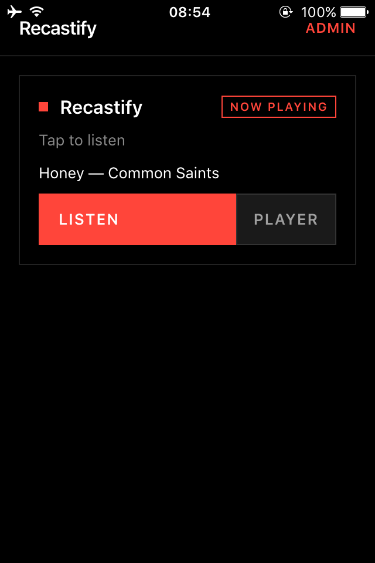
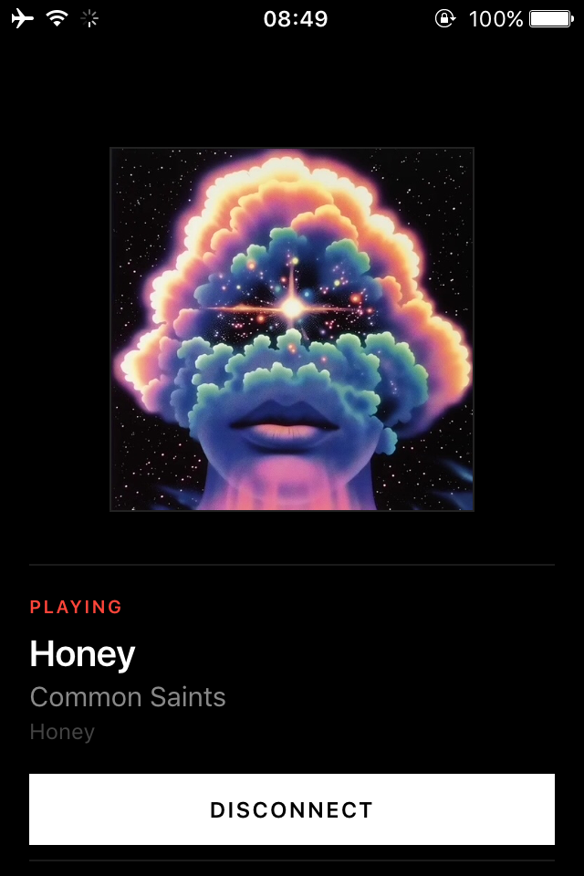

# Recastify

Stream audio from modern AirPlay sources (iOS/macOS) to legacy web browsers (such as Safari on legacy iOS devices) docked in legacy audio systems.

```
AirPlay source (like Spotify on iOS/macOS)
     │ 
     ▼
shairport-sync  ──PCM pipe──▶  ffmpeg  ──MP3──▶  Icecast
                                                     │
                                                     ▼
                                              Legacy Browser
```

| Stream Picker | Fullscreen Player | Fullscreen Cover Art |
|:---:|:---:|:---:|
|  |  |  |

---

## Overview

Recastify allows streaming audio from modern AirPlay devices to legacy hardware (such as an iPod or iPhone 4 stuck on iOS 9) docked in legacy speaker systems. Since modern streaming applications no longer support legacy iOS versions, Recastify bridges the gap:

1. **AirPlay Receiver:** A Docker container running `shairport-sync` advertises an AirPlay target.
2. **Audio Re-encoding:** Raw PCM audio is piped to `ffmpeg`, encoded to MP3, and streamed to an Icecast server.
3. **Web Playback:** Legacy devices load a lightweight Web UI served by a C# .NET 10 controller to stream the audio and display real-time track metadata.

---

## Components

| Container | Image | Role |
|---|---|---|
| `bridge` | `mikebrady/shairport-sync` + ffmpeg | Virtual AirPlay receiver; encodes PCM audio to MP3 and pushes it to Icecast. |
| `icecast` | `infiniteproject/icecast` | Serves the MP3 HTTP stream. |
| `mqtt` | `eclipse-mosquitto:2` | Routes track metadata (title, artist, album, cover art) from shairport-sync to the controller. |
| `controller` | Built from this repo | C# .NET 10 web server serving the REST API and legacy-optimized Web UI. |

---

## Quick Start (All-in-One Container)

Recastify is packaged as a single Docker container containing shairport-sync, ffmpeg, Icecast, Mosquitto, and the controller.

### Docker Compose

Save the following as `docker-compose.yml`:

```yaml
services:
  recastify:
    image: ghcr.io/kiwiprojekt/recastify:main
    platform: linux/amd64
    container_name: recastify
    restart: unless-stopped
    network_mode: host
    cap_add:
      - SYS_NICE
    command: ["all-in-one"]
    environment:
      # AirPlay receiver name shown in iOS/macOS AirPlay menu
      AIRPLAY_NAME: "Recastify"

      # Icecast stream settings
      ICECAST_PORT: "8100"
      ICECAST_MOUNT: "/stream"
      ICECAST_SOURCE_PASSWORD: "changeme"
      ICECAST_ADMIN_PASSWORD: "changeme"
      
      # Bridge ID (must match the mount path without the leading slash)
      BRIDGE_ID: "stream"

      # Audio encoding settings
      AUDIO_BITRATE: "320k"
      
      # Path where config.yaml is persisted
      CONFIG_PATH: "/data/config.yaml"
    volumes:
      - recastify-config:/data
    logging:
      options:
        max-size: "200k"
        max-file: "5"

volumes:
  recastify-config:
```

### Deployment

Run the stack:

```sh
docker compose up -d
```

> [!NOTE]
> Recastify requires `network_mode: host` so the AirPlay receiver is discoverable on your local network via mDNS. Icecast listens on port **8100**, and the Web UI is served on port **3000**.

### Usage

1. Open a music application on a modern iOS/macOS device, tap the AirPlay icon, and select your configured **AIRPLAY_NAME**.
2. Open `http://<your-server-ip>:3000` in Safari on the legacy docked device.
3. Tap **Listen** to begin streaming.

*Note: Use the **Add to Home Screen** option in Safari to run the application in standalone PWA mode, removing browser navigation chrome.*

---

## Environment Variables

Configuration can be customized via environment variables. If a `config.yaml` file is present, it will take precedence.

| Variable | Default | Description |
|---|---|---|
| `AIRPLAY_NAME` | `Recastify` | Name shown in the AirPlay device list. |
| `ICECAST_HOST` | `localhost` | Icecast server hostname. |
| `ICECAST_PORT` | `8100` | Icecast server port. |
| `ICECAST_SOURCE_PASSWORD` | `hackme` | Password used by shairport-sync/ffmpeg to stream to Icecast. |
| `ICECAST_MOUNT` | `/stream` | Icecast mount point. |
| `AUDIO_BITRATE` | `320k` | Target MP3 bitrate (e.g. `128k`, `192k`, `256k`, `320k`). |
| `BRIDGE_ID` | `default` | Identifier used in API responses and MQTT topics. |
| `MQTT_HOST` | `localhost` | Mosquitto MQTT broker hostname. |
| `MQTT_PORT` | `1883` | Mosquitto MQTT broker port. |
| `CONTROLLER_URL` | `localhost:3000` | Controller hostname and port (used by shairport-sync hooks). |
| `WEB_UI_PORT` | `3000` | Port the controller listens on. |
| `DISABLE_STREAM_PROXY` | `true` | When true, disables the same-origin stream proxy. |
| `CONFIG_PATH` | `/app/config.yaml` | Path to the config file inside the container. |

---

## Web UI Pages

Served on port `3000`:

| Path | Description |
|---|---|
| `/` | **Stream Picker:** Lists active audio bridges with their playback status and metadata. Includes an inline player. |
| `/player?bridge=<id>` | **Fullscreen Player:** Legacy-optimized interface showing artwork, titles, albums, and artists. Handles automated reconnections. |
| `/admin` | **Admin Dashboard:** Control panel to add, edit, start, stop, and delete bridges. |
| `/debug-player?bridge=<id>` | **Debug Player:** Diagnostics dashboard logging real-time HTML5 audio events, ready states, network states, and CORS status. |

> [!WARNING]
> **iOS Standalone Mute Switch Quirk:** When running in Home Screen standalone mode, legacy iOS versions use a webview audio session that respects the physical ring/silent mute switch on the side of the device. If there is no audio, verify that the physical mute switch is turned off. (Standard Safari browsing is unaffected).

---

## REST API

| Method | Path | Description |
|---|---|---|
| `GET` | `/api/bridges` | List all bridges with current status and now-playing metadata. |
| `POST` | `/api/bridges` | Register a new audio bridge. |
| `PUT` | `/api/bridges/:id` | Update an existing bridge configuration. |
| `DELETE` | `/api/bridges/:id` | Remove a bridge configuration. |
| `POST` | `/api/bridges/:id/start` | Start an audio bridge daemon. |
| `POST` | `/api/bridges/:id/stop` | Stop an audio bridge daemon. |
| `POST` | `/api/status` | Internal hook callback registered by shairport-sync hooks. |
| `GET` | `/api/bridges/:id/art` | Serves cover art as JPEG or PNG. |
| `GET` | `/api/bridges/:id/stream` | Same-origin stream proxy (pipes Icecast stream through the controller to bypass PWA cross-origin media blocks). |
| `POST` | `/api/bridges/:id/command/:command` | Forward remote control actions (`playpause`, `nextitem`, `previtem`, `volumeup`, `volumedown`) via DACP to the active AirPlay sender. |
| `POST` | `/api/config` | Update application configuration preferences. |
| `GET` | `/api/health` | Service health check. |

### Example API Response (`GET /api/bridges`)

```json
{
  "bridges": [
    {
      "id": "living-room",
      "name": "Living Room",
      "mount": "/living-room",
      "stream_url": "http://192.168.1.50:8000/living-room",
      "state": "playing",
      "listeners": 1,
      "bitrate": "320k",
      "enabled": true,
      "now_playing": {
        "title": "Bohemian Rhapsody",
        "artist": "Queen",
        "album": "A Night at the Opera",
        "artwork_url": "/api/bridges/living-room/art",
        "elapsed_ms": 204000,
        "duration_ms": 355000,
        "updated_at": "2026-04-16T15:30:01Z"
      }
    }
  ]
}
```

---

## Auto-Reconnect Mechanism

When AirPlay streaming pauses, the source stops outputting audio. The `ffmpeg` pipe subsequently stalls, causing Icecast to disconnect and drop the mount point. Standard legacy browsers interpret this as a terminal stream failure and stop playback.

Recastify implements automated reconnection recovery:

1. **Hooks:** `shairport-sync` triggers native scripts on state change, issuing a `POST /api/status` containing `state: playing` or `state: paused` to the controller.
2. **Poller:** The controller polls the Icecast status API every 5 seconds to verify active mounts.
3. **Web Client:** The browser client polls `/api/bridges` every 2 seconds. When it detects a bridge state transition from `paused` to `playing`, it reinitializes the HTML5 `<audio>` element to resume playback automatically.

---

## Development and Compilation

### Local Development (Controller Only)

To build and execute the C# controller locally:

```sh
cd src/controller
dotnet build
dotnet run
```

The service will run locally at `http://localhost:3000`.

### Production Docker Build

Build the production multi-stage image:

```sh
cd src
docker build -t recastify .
```

* **Stage 1 (AOT Compilation):** Uses `mcr.microsoft.com/dotnet/sdk:10.0-alpine` to compile the C# controller using Native AOT into a single, high-performance Linux binary.
* **Stage 2 (Packaging):** Copies the binary into the `mikebrady/shairport-sync` Alpine base image along with `ffmpeg`, `Icecast`, and `Mosquitto`.

### Hot-Reload Development

Use `controller/Dockerfile.dev` (which builds without AOT for faster iteration) in your development `docker-compose.yml` configuration.

---

## License

MIT — see [LICENSE.md](LICENSE.md).
