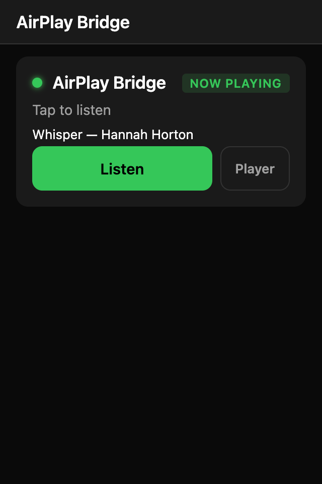
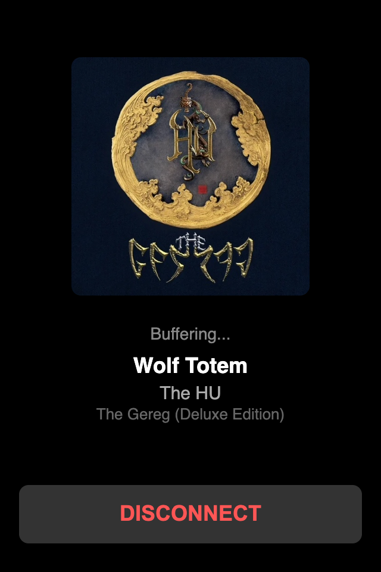
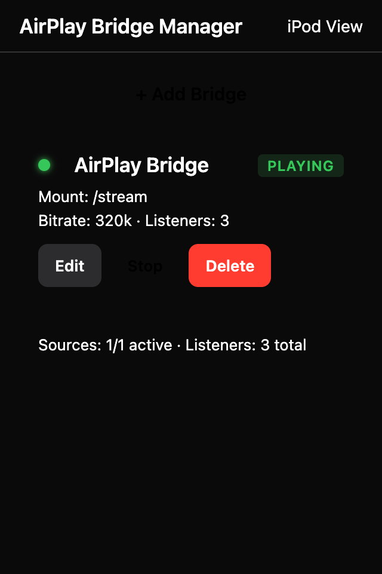

# Recastify

Stream any app's audio from an iPhone/iPad/Mac to a web browser — including devices that predate modern streaming services, like an iPhone 4 (iOS 9.3.6).

```
AirPlay source (like spotify on iPhone)
    │ 
    ▼
shairport-sync  ──PCM pipe──▶  ffmpeg  ──MP3──▶  Icecast
                                                    │
                                                    ▼
                                             web browser
```

| Main | Player | Admin |
|:---:|:---:|:---:|
|  |  |  |

---

## The Problem

The Yamaha TSX-130 is a great-sounding mini audio system, but its only input is an Apple 30-pin dock connector — designed for iPods and iPhones from the pre-Lightning era. Those old devices are stuck on iOS 9 or earlier, and every modern streaming service (Spotify, Apple Music, YouTube Music, etc.) has long since dropped support for them.

The hardware is perfectly fine. The speakers sound great. But there's no way to get music from any modern source into it — no Bluetooth, no AUX, no AirPlay, just a 30-pin dock that expects an obsolete iPod.

The goal: **play Spotify (or any other audio source) on the Yamaha through that old iPhone, without jailbreaking or sideloading**

## How It's Solved

Use what even the oldest iOS devices have — Safari and a web browser that can play audio.

1. **Send audio via AirPlay** from the iPhone running Spotify (or Apple Music, YouTube, anything). This uses the native iOS AirPlay button — no app modification, no Spotify involvement.
2. **Receive and re-encode** with [shairport-sync](https://github.com/mikebrady/shairport-sync) (the standard open-source AirPlay receiver) running in Docker. Audio is piped as raw PCM to ffmpeg, re-encoded to MP3, and pushed to an Icecast HTTP stream.
3. **Play the stream** in Safari on the old iPod/iPhone docked in the Yamaha. The web UI auto-reconnects when audio pauses or resumes, shows track metadata and cover art via MQTT, and works as a full-screen Home Screen app.

The iPod sits in the dock, Safari plays the stream, and the Yamaha's speakers and amplifier do the rest.

---

### Components

| Container | Image | Role |
|---|---|---|
| `bridge` | `mikebrady/shairport-sync` + ffmpeg | Receives AirPlay, encodes to MP3, pushes to Icecast |
| `icecast` | `infiniteproject/icecast` | Serves the MP3 HTTP stream |
| `mqtt` | `eclipse-mosquitto:2` | Routes track metadata (title, artist, cover art) from shairport-sync to the controller |
| `controller` | Built from this repo | C# .NET 10 web server — REST API + static web UI |

## Quick Start (Portainer / Single Container)

The easiest way to deploy Recastify is as a single-container deployment. This bundles shairport-sync, ffmpeg, Icecast, Mosquitto, and the controller into one prebuilt image. It is perfect for Portainer stacks or a simple Docker Compose setup.

### Docker Compose

Save the following as `docker-compose.yml` (or paste it into your Portainer stack):

```yaml
services:
  recastify:
    image: ghcr.io/kiwiprojekt/recastify:main
    platform: linux/amd64
    container_name: recastify
    restart: unless-stopped
    network_mode: host
    cap_add:
      - SYS_NICE
    command: ["all-in-one"]
    environment:
      # AirPlay receiver name (shows up in iOS/macOS AirPlay menu)
      AIRPLAY_NAME: "Recastify"

      # Icecast stream settings
      ICECAST_PORT: "8100"
      ICECAST_MOUNT: "/stream"
      ICECAST_SOURCE_PASSWORD: "changeme"
      ICECAST_ADMIN_PASSWORD: "changeme"
      # Bridge ID must match the mount path (without leading slash)
      BRIDGE_ID: "stream"

      # Audio encoding
      AUDIO_BITRATE: "320k"
      # Path where config.yaml is persisted
      CONFIG_PATH: "/data/config.yaml"
    volumes:
      - recastify-config:/data
    logging:
      options:
        max-size: "200k"
        max-file: "5"

volumes:
  recastify-config:
```

### Running the Stack

```sh
docker compose up -d
```

> [!NOTE]
> Recastify uses `network_mode: host` so the AirPlay receiver is directly discoverable on your local network. Icecast listens on port **8100**, and the web UI is served on port **3000**.

### How to Use

1. **AirPlay Source:** Open Spotify (or any audio app) on your modern iPhone/iPad/Mac. Tap the AirPlay icon and select **Recastify**.
2. **Receiver:** Open `http://<server-ip>:3000` in Safari on your old docked iPod/iPhone.
3. **Play:** Tap **Listen** on the bridge card.

*Tip: Use **Add to Home Screen** in Safari for a full-screen, native-app-like experience.*

---

## Environment Variables

All configuration can be done via environment variables. The `config.yaml` file takes precedence when present.

| Variable | Default | Description |
|---|---|---|
| `AIRPLAY_NAME` | `Recastify` | Name shown in the AirPlay device list |
| `ICECAST_HOST` | `localhost` | Icecast hostname (use `icecast` in Docker Compose) |
| `ICECAST_PORT` | `8000` | Icecast port |
| `ICECAST_SOURCE_PASSWORD` | `hackme` | **Change this.** Icecast source password |
| `ICECAST_MOUNT` | `/stream` | Icecast mount point |
| `AUDIO_BITRATE` | `320k` | MP3 bitrate (e.g. `128k`, `192k`, `256k`, `320k`) |
| `BRIDGE_ID` | `default` | Identifier used in API responses and MQTT topics |
| `MQTT_HOST` | `localhost` | Mosquitto hostname |
| `MQTT_PORT` | `1883` | Mosquitto port |
| `CONTROLLER_URL` | `localhost:3000` | Controller address (used by shairport-sync hooks) |
| `WEB_UI_PORT` | `3000` | Port the controller listens on |
| `CONFIG_PATH` | `/app/config.yaml` | Path to config.yaml inside the container |

---

## Web UI

Three pages served at port `3000`:

| URL | Description |
|---|---|
| `/` | Stream picker — lists all bridges with live status and now-playing metadata. Tap **Listen** to start playing, **Player** to open the full-screen player. |
| `/player?bridge=<id>` | Full-screen player — cover art, track title/artist/album, auto-reconnects on stream drop. Designed as an iOS Home Screen app. |
| `/admin` | Admin panel — add, edit, start, stop, and delete bridges. |

### iOS PWA (Add to Home Screen)

The player page supports **Add to Home Screen** on iOS for a full-screen, app-like experience without Safari's address bar. Tested on **iPhone 4 with iOS 9.3.6**.

> **Mute switch:** When running as a Home Screen app (standalone mode), iOS uses the UIWebView audio session which **respects the hardware ringer/silent switch**. If you hear no audio, make sure the mute switch on the side of the device is off. This does not apply when using Safari directly.

---

## REST API

| Method | Path | Description |
|---|---|---|
| `GET` | `/api/bridges` | List all bridges with status and now-playing |
| `POST` | `/api/bridges` | Add a bridge |
| `PUT` | `/api/bridges/:id` | Update bridge config |
| `DELETE` | `/api/bridges/:id` | Remove a bridge |
| `POST` | `/api/bridges/:id/start` | Start a bridge |
| `POST` | `/api/bridges/:id/stop` | Stop a bridge |
| `POST` | `/api/status` | Session hook callback (called by shairport-sync hooks) |
| `GET` | `/api/bridges/:id/art` | Cover art as JPEG/PNG |
| `GET` | `/api/bridges/:id/stream` | Same-origin stream proxy (pipes Icecast MP3 through the controller — needed for iOS PWA which blocks cross-origin audio) |
| `POST` | `/api/bridges/:id/command/:command` | Remote control (play, pause, next, prev) via MQTT |
| `GET` | `/api/health` | Health check |

### Example response

```json
{
  "bridges": [
    {
      "id": "living-room",
      "name": "Living Room",
      "mount": "/living-room",
      "stream_url": "http://192.168.1.50:8000/living-room",
      "state": "playing",
      "listeners": 1,
      "bitrate": "320k",
      "enabled": true,
      "now_playing": {
        "title": "Bohemian Rhapsody",
        "artist": "Queen",
        "album": "A Night at the Opera",
        "artwork_url": "/api/bridges/living-room/art",
        "elapsed_ms": 204000,
        "duration_ms": 355000,
        "updated_at": "2026-04-16T15:30:01Z"
      }
    }
  ]
}
```

---

## Building

### Controller only (development)

```sh
cd src/controller
dotnet build
dotnet run
```

The dev server starts at `http://localhost:3000`.

### Docker image

```sh
cd src
docker build -t recastify .
```

The Dockerfile uses a multi-stage build:
- **Stage 1:** `mcr.microsoft.com/dotnet/sdk:10.0-alpine` — compiles the C# controller with Native AOT to a single Linux binary.
- **Stage 2:** `mikebrady/shairport-sync` (Alpine-based) — adds ffmpeg, Icecast, Mosquitto, and the compiled controller binary.

### Development with hot-reload

`controller/Dockerfile.dev` builds without AOT for faster iteration and is used by `docker-compose.yml` by default.

---

## How Auto-Reconnect Works

When AirPlay stops (e.g. you pause Spotify), ffmpeg stalls on the empty pipe and eventually loses its Icecast connection. The mount disappears. Safari on the iPod sees the stream end.

The web UI handles this gracefully:

1. **shairport-sync hooks** fire a `POST /api/status` to the controller with `state: paused` when play ends, and `state: playing` when it resumes.
2. **The controller** also polls the Icecast status API every 5 seconds to verify which mounts are live.
3. **The iPod web UI** polls `/api/bridges` every 2 seconds. When a bridge transitions from `paused` → `playing`, it automatically reconnects the `<audio>` element — no user action needed.

---

## Legal Notes
- This is intended for personal use on your own network.

---

## License

MIT — see [LICENSE](LICENSE).
